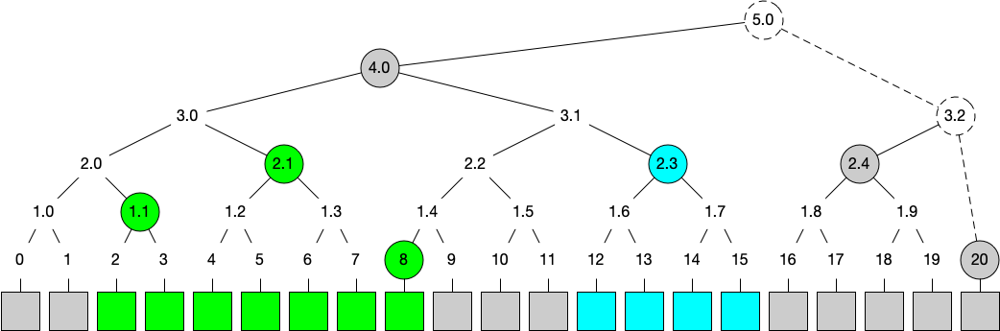
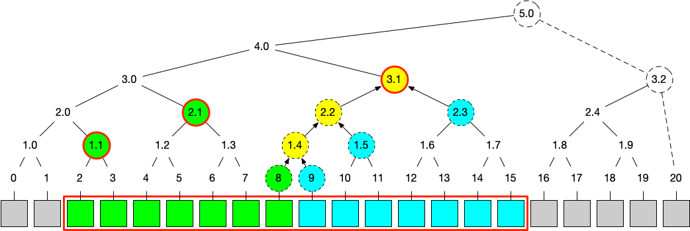
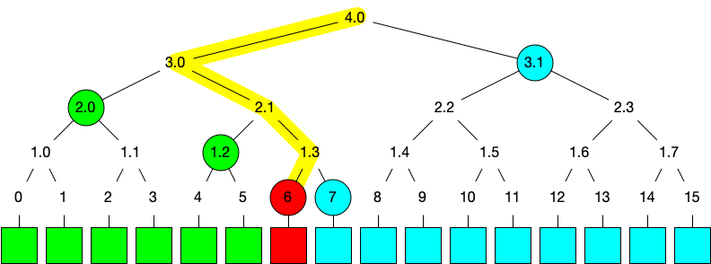
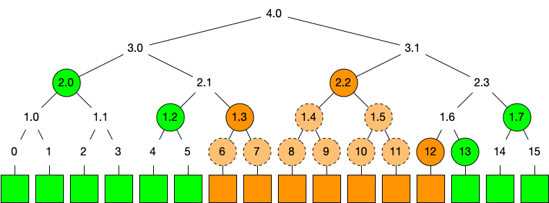
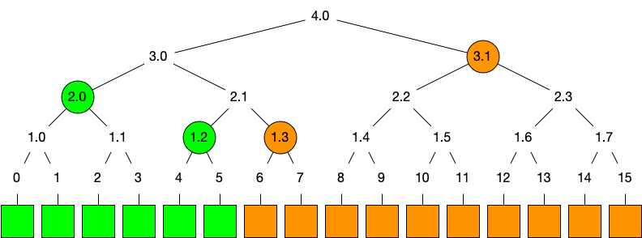

Compact Ranges
==============

This document introduces **compact ranges**, a mental model and technique for
reasoning about Merkle trees[^1] and proofs. We present the definition, the
properties, and the applications of this technique.

[^1]: In this doc, by Merkle trees we mean a subclass known as "history trees"
introduced by Crosby and Wallach in "Efficient Data Structures for
Tamper-Evident Logging"
[paper](https://static.usenix.org/event/sec09/tech/full_papers/crosby.pdf).

## Definition

We call a tree node **perfect** if the subtree that it roots is a perfect
binary tree. For example, in the picture below nodes `3`, `1.2`, `3.1` and
`4.0` are perfect. A perfect node at level `H` has exactly `2^H` leaves in its
subtree, and we say that it *covers* these leaves. Correspondingly, we call all
the other nodes, such as `3.2` and `5.0`, *ephemeral*. Perfect nodes are
immutable, i.e. the corresponding subtree contents and hash don't change when
new leaves are appended to the Merkle tree. Ephemeral nodes, on the other hand,
are modified each time a new leaf is added, until they become perfect.

For a range `[L, R)` of leaves in a Merkle tree, a **compact range** is the
minimal set of perfect nodes that cover these, and only these, leaves. For
example, in the picture below, the range `[2, 9)` is covered by perfect nodes
`[1.1, 2.1, 8]`, and the range `[12, 16)` is covered by a single perfect node
`2.3`.

Note that, in the picture above, range `[0, 21)` could be covered by a single
node `5.0`. However, we only use the perfect nodes for a compact range, so it
rather consists of `[4.0, 2.4, 20]`. The idea is that nodes of the compact
range are immutable, regardless of the tree size. For simplicity, when we talk
about compact ranges, we can assume that the ephemeral nodes don’t exist.

Compact ranges have many useful properties, some of which are elaborated in
sections below. The basic property is that the number of nodes in a compact
range `[L, R)` is `O(log(R-L))`, or `O(log N)` more generally. A compact range
is always unique, and its shape is determined using a few bitwise operations on
`L` and `R`.

## Merging Compact Ranges

The core property that makes compact ranges widely usable is that they are
“mergeable”. Two compact ranges, `[L, M)` and `[M, R)`, can be efficiently
merged into an `[L, R)` range. Consider the picture below for an intuitive
understanding of how it works.

Given two compact ranges, `[2, 9)` and `[9, 16)`, each represented by a set of
node hashes (three green and three cyan nodes correspondingly), we “merge” two
sibling nodes by computing their parent’s hash any time they are both present
in the set of nodes. This process repeats until there are no siblings in the
set. As a result, we get hashes of nodes `[1.1, 2.1, 3.1]` which, as it turns
out, represent a compact range of `[2, 16)`.

Note that, when merging two compact ranges, the set of “new” nodes (marked in
yellow) that are generated as a side effect, forms a partial path towards the
root of the tree. It can be proven that this is always the case, which is a
convenient property for implementations.

Merging two compact ranges can be implemented in `O(log(R-L))`, or more
generally `O(log N)` time. This follows from the observation in the paragraph
above, and the fact that the size of the resulting `[L, R)` compact range is
limited by the same estimate.

## Merkle Tree Proofs

A compact range `[L, R)`, if represented by the cryptographic hashes of the
corresponding nodes, can be considered a commitment to the contents of the
leaves in this range. The ability to merge compact ranges is effectively the
ability to merge commitments.

### Root Hash

For a Merkle tree with `N` leaves, the compact range `[0, N)` represents a
succinct state of the entire tree.

Often applications further reduce the size of this state down to a single hash.
For example, in a tree with 21 leaves, as in the picutures above, this would be
a hash of the ephemeral node `5.0`. We refer to this as the **root hash**.

Merkle tree proofs verification uses the root hash (directly or indirectly) as
the trust anchor. Usually the root hash is cryptographically signed and
committed to by a server.

### Inclusion Proofs Revisited

An **inclusion proof** helps a client to verify that, in a Merkle tree of the
given state / root hash, a certain leaf position `i` matches the given value.

Intuitively, such a proof is the information that the client combines with the
leaf hash in order to compute the root hash, which is then compared with the
trusted one. The root hashes should match iff the leaf hash is correct (except
a negligible probability of hash collisions).

More specifically, for a leaf at index `i`, the server can give the compact
ranges `[0, i)` and `[i+1, N)`, which the client can verify by merging with a
middle range `[i, i+1)` formed simply as the hash of this leaf. The result
will be a compact range `[0, N)`, which can be compared with the trusted root
hash.

In the example above, an inclusion proof for leaf `6` consists of compact
ranges `[0, 6)` and `[7, 16)`.

Note that the same nodes `[3.1, 2.0, 1.2, 7]` can be viewed as the siblings of
the path going from the root to the leaf. This is a classic "vertical" way of
thinking about Merkle tree proofs. It is used, for example, in [RFC
6962](https://datatracker.ietf.org/doc/html/rfc6962#section-2.1).

### Arbitrary Inclusion Proofs

In the previous section we established that an inclusion proof can be
decomposed into two compact ranges at both sides from the leaf in question.
Note that these compact ranges represent the "complementary" part of the Merkle
tree, i.e. the entire range minus the leaf. We can generalize this observation:
an inclusion proof for an **arbitrary subset** of leaves is a commitment to its
complementary part of the tree.

For example, consider the case when we want to prove the authenticity of values
within the range `[6, 13)`, as shown in the picture below.

To do so, the server can provide two compact ranges: `[0, 6)` and `[13, 16)`.
The client will then construct the middle compact range locally (based on the
leaf hashes of values between `6` and `12` that they know), and merge it with
the two boundary compact ranges. Then they compute the root hash from the
resulting compact range, and compare it against the trusted root hash.

This construction is called a **range inclusion proof**.

In a more general case, to prove the inclusion of an arbitrary subset of
entries, the server needs to provide a compact range for each of the “gaps” in
leaves. The verifier will then construct compact ranges for each contiguous
part of the leaves in question, and merge them with all the "gap" compact
ranges provided by the prover.

It is easy to see that a range inclusion proof takes `O(log N)` hashes of
space. The general case, **multi-entry inclusion proof**, is less
straightforward: depending on the number of leaves in question, and how close
they are to each other, the proof size varies between `O(log N)` to `O(N)`. The
multi-entry proof is always optimal though, and thus more efficient than many
individual entry inclusion proofs which could cost `O(N log N)`.

### Consistency Proofs

A consistency proof (or proof of the append-only property) proves to a client
that one tree state is the result of appending some entries to another state.

The definition of the consistency proof already contains a hint on how to model
it with compact ranges. Suppose a client knows a compact range of the old tree,
like `[0, 6)` in the picture above, and the server wants to prove that another
state with 16 entries is an extension of the first 6 entries. The server
provides a compact range of the appended entries `[6, 16)`. The client can then
merge `[0, 6)` with `[6, 16)`, and compare the resulting compact range `[0,
16)` with the advertised root hash.

If the client does not have the compact range of the old tree, it can be
provided by the server too. The classic consistency proof
[algorithm](https://datatracker.ietf.org/doc/html/rfc6962#section-2.1.2) in RFC
6962 doesn’t assume that the client has a mergeable commitment. So, instead of
just compact range `[6, 16)`, it roughly[^2] consists of both the old compact range
and the one that covers the appended entries.

[^2]: In RFC 6962 the proof size has fewer nodes in most cases, e.g. the
perfect nodes on the right border of the tree are replaced by a single
ephemeral node.
