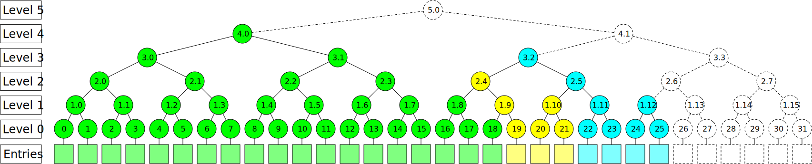

Data Model
==========

This document establishes terminology shared throughout this repositotry around
the structure and components of the Merkle tree.

### Merkle tree

In this repository, by Merkle trees we mean a slightly modified version of
"history trees" introduced by Crosby and Wallach in the *Efficient Data
Structures for Tamper-Evident Logging*
[paper](https://static.usenix.org/event/sec09/tech/full_papers/crosby.pdf).

The basis of the data structure is an append-only **log** consisting of log
**entries**, numbered with consecutive integers starting from 0.

Built on top of the log entries, there is a highly regular structure of nodes of
a perfect binary tree-like shape. Nodes are addressed as `(level, index)` pairs.
Nodes at level 0 are called **leaf nodes**, and correspond directly to the log
entries. Nodes at higher levels are defined recursively based on nodes of the
lower levels. Specifically, `(level, index)` depends directly on nodes
`(level-1, index*2)` and `(level-1, index*2 + 1)`, and, recursively, nodes of
its entire subtree.

The data structure evolves dynamically. Initially, the log is empty, and all
the nodes of the tree have no data. When new entries are appended to the log,
nodes that recursively depend on these entries are updated. While the nodes can
be updated, they are in **ephemeral** state. Eventually, when the log grows
past a certain size, a node becomes **perfect**, and is never modified again.

Effectively, perfect nodes are immutable / write-once registers, and ephemeral
nodes are mutable.

### Tree state

To represent the state of the entire log, often a single ephemeral node is used
which covers all the corresponding leaves. For example, in a tree with 21
leaves, as in the picture above, this would be the ephemeral node 5.0.

### TODO: Things to cover:

- Append-only.
- Merkle tree hasher.
- Structured objects, like proofs and compact ranges.
